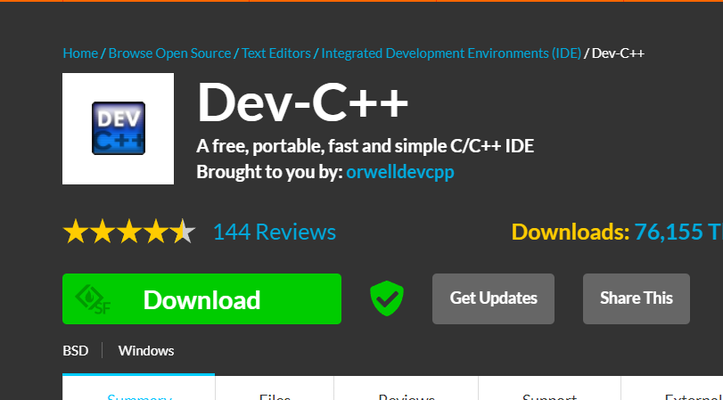
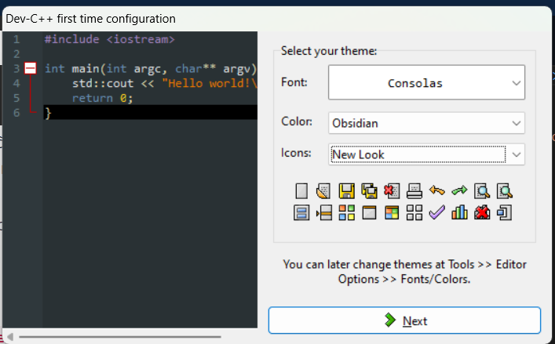
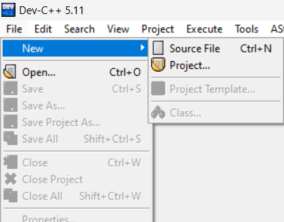
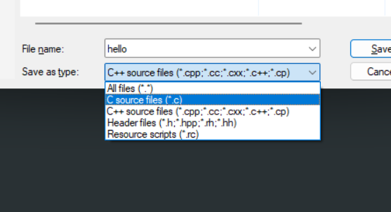
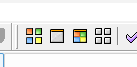

# Giáo Trình Lập Trình C (PRF192)

## Giới Thiệu

- Bài giảng này được ghi bởi team của MjnThep, vui lòng ghi nguồn <3
- Môn này nếu các bạn không học được thì không sao cả, lên môn Java tìm lại đam mê bằng cách học giải thuật, tạo ra 1 cái gì đó thú vị như 1 trang web, 1 bài toán hình trái tim :>, nói chung tìm đam mê trong môn này nhé chúc mọi người học tốt.

- C được sáng tác bởi Dennis Ritchie vào năm 1972, và được phát hành lần đầu tiên vào năm 1978. (học để làm FE :))))))

## Điểm Số Tối Đa: 10

### Đánh Giá Liên Tục:

- 02 Quiz (Q) (10%)
- 08 Workshops (W) (10%)
- 01 Bài Tập (AS) (10%)
- 01 Kỳ Thi Thực Hành (PE) (40%)
- Kỳ Thi Cuối (FE) (30%) (Co The Retake lai FE)

### Công Thức Tính Điểm Tổng:

Total score = 0.1*Q + 0.1*W + 0.1*AS + 0.4*PE + 0.3\*FE

### Điều Kiện Đậu:

- Mỗi thành phần đánh giá liên tục phải > 0
- Kỳ Thi Thực Hành >= 4 (PE thi ở tuần 8-9, và 1 mạng)
- Điểm Kỳ Thi Cuối ≥ 4 (FE thi ở tuần 11, và 2 mạng)
- Tổng điểm ≥ 5

### Quy Định Thi Lại:

- FE chỉ được thi lại khi không đạt yêu cầu.
- Có thể xin cải thiện điểm bằng cách gửi đơn.

---

# Mục Lục (Một số cái tag ở dưới bị lỏ do trong quá trình cập nhật thay đổi bị tag nên bấm không được cái menu)

## [Chương 1: Cài Đặt Môi Trường Lập Trình C (FUOVERFLOW - DO NOT COPY)](#chương-1-cài-đặt-môi-trường-lập-trình-c)

- [1.1. Giới thiệu về môi trường lập trình (FUOVERFLOW - DO NOT COPY)](#11-giới-thiệu-về-môi-trường-lập-trình)
- [1.2. Cài đặt DEV-C++ (FUOVERFLOW - DO NOT COPY)](#12-cài-đặt-dev-c)
- [1.3. Cấu trúc giao diện DEV-C++ (FUOVERFLOW - DO NOT COPY)](#13-cấu-trúc-giao-diện-dev-c)

## [Chương 2: Viết Chương Trình Hello World (FUOVERFLOW - DO NOT COPY)](#chương-2-viết-chương-trình-hello-world)

- [2.1. Giới thiệu về chương trình Hello World (FUOVERFLOW - DO NOT COPY)](#21-giới-thiệu-về-chương-trình-hello-world)
- [2.2. Cú pháp cơ bản (FUOVERFLOW - DO NOT COPY)](#22-cú-pháp-cơ-bản)
- [2.3. Biên dịch và chạy chương trình (FUOVERFLOW - DO NOT COPY)](#23-biên-dịch-và-chạy-chương-trình)
- [2.4. Bài tập thực hành (FUOVERFLOW - DO NOT COPY)](#24-bài-tập-thực-hành)

## [Chương 3: Biến và Kiểu Dữ Liệu (FUOVERFLOW - DO NOT COPY)](#chương-3-biến-và-kiểu-dữ-liệu)

- [3.1. Giới thiệu về biến (FUOVERFLOW - DO NOT COPY)](#31-giới-thiệu-về-biến)
- [3.2. Các kiểu dữ liệu cơ bản (FUOVERFLOW - DO NOT COPY)](#32-các-kiểu-dữ-liệu-cơ-bản)
- [3.3. Khai báo và khởi tạo biến (FUOVERFLOW - DO NOT COPY)](#33-khai-báo-và-khởi-tạo-biến)
- [3.4. Toán tử gán (FUOVERFLOW - DO NOT COPY)](#34-toán-tử-gán)
- [3.5. Literals và Constants (FUOVERFLOW - DO NOT COPY)](#35-literals-và-constants)
- [3.6. Bài tập thực hành (FUOVERFLOW - DO NOT COPY)](#36-bài-tập-thực-hành)

## [Chương 4: Đầu Vào và Đầu Ra (FUOVERFLOW - DO NOT COPY)](#chương-4-đầu-vào-và-đầu-ra)

- [4.1. Giới thiệu về đầu vào và đầu ra (FUOVERFLOW - DO NOT COPY)](#41-giới-thiệu-về-đầu-vào-và-đầu-ra)
- [4.2. Sử dụng hàm printf (FUOVERFLOW - DO NOT COPY)](#42-sử-dụng-hàm-printf)
- [4.3. Sử dụng hàm scanf (FUOVERFLOW - DO NOT COPY)](#43-sử-dụng-hàm-scanf)
- [4.4. Bài tập thực hành (FUOVERFLOW - DO NOT COPY)](#44-bài-tập-thực-hành)

## [Chương 5: Biểu Thức và Toán Tử (FUOVERFLOW - DO NOT COPY)](#chương-5-biểu-thức-và-toán-tử)

- [5.1. Giới thiệu về biểu thức (FUOVERFLOW - DO NOT COPY)](#51-giới-thiệu-về-biểu-thức)
- [5.2. Các loại toán tử (FUOVERFLOW - DO NOT COPY)](#52-các-loại-toán-tử)
- [5.3. Độ ưu tiên của toán tử (FUOVERFLOW - DO NOT COPY)](#53-độ-ưu-tiên-của-toán-tử)
- [5.4. Bài tập thực hành (FUOVERFLOW - DO NOT COPY)](#54-bài-tập-thực-hành)

## [Chương 6: Logic Cơ Bản và Cấu Trúc Rẽ Nhánh (FUOVERFLOW - DO NOT COPY)](#chương-6-logic-cơ-bản-và-cấu-trúc-rẽ-nhánh)

- [6.1. Giới thiệu về cấu trúc logic (FUOVERFLOW - DO NOT COPY)](#61-giới-thiệu-về-cấu-trúc-logic)
- [6.2. Mệnh đề If-Else (FUOVERFLOW - DO NOT COPY)](#62-mệnh-đề-if-else)
- [6.3. Câu lệnh Switch-Case (FUOVERFLOW - DO NOT COPY)](#63-câu-lệnh-switch-case)
- [6.4. Các kiểu logic constructs (FUOVERFLOW - DO NOT COPY)](#64-các-kiểu-logic-constructs)
- [6.5. Bài tập thực hành (FUOVERFLOW - DO NOT COPY)](#65-bài-tập-thực-hành)

## [Chương 7: Vòng Lặp (FUOVERFLOW - DO NOT COPY)](#chương-7-vòng-lặp)

- [7.1. Vòng lặp For (FUOVERFLOW - DO NOT COPY)](#71-vòng-lặp-for)
- [7.2. Vòng lặp While và Do-While (FUOVERFLOW - DO NOT COPY)](#72-vòng-lặp-while-và-do-while)
- [7.3. Câu lệnh Break và Continue (FUOVERFLOW - DO NOT COPY)](#73-câu-lệnh-break-và-continue)
- [7.4. Bài tập thực hành (FUOVERFLOW - DO NOT COPY)](#74-bài-tập-thực-hành)

## [Chương 8: Mảng (FUOVERFLOW - DO NOT COPY)](#chương-8-mảng)

- [8.1. Giới thiệu về mảng (FUOVERFLOW - DO NOT COPY)](#81-giới-thiệu-về-mảng)
- [8.2. Khai báo và sử dụng mảng (FUOVERFLOW - DO NOT COPY)](#82-khai-báo-và-sử-dụng-mảng)
- [8.3. Mảng hai chiều (FUOVERFLOW - DO NOT COPY)](#83-mảng-hai-chiều)
- [8.4. Các phép toán với mảng (FUOVERFLOW - DO NOT COPY)](#84-các-phép-toán-với-mảng)
- [8.5. Bài tập thực hành (FUOVERFLOW - DO NOT COPY)](#85-bài-tập-thực-hành)

## [Chương 9: Chuỗi (FUOVERFLOW - DO NOT COPY)](#chương-9-chuỗi)

- [9.1. Giới thiệu về chuỗi (FUOVERFLOW - DO NOT COPY)](#91-giới-thiệu-về-chuỗi)
- [9.2. Null-String/C-String (FUOVERFLOW - DO NOT COPY)](#92-null-stringc-string)
- [9.3. Khai báo và khởi tạo chuỗi (FUOVERFLOW - DO NOT COPY)](#93-khai-báo-và-khởi-tạo-chuỗi)
- [9.4. Lưu trữ dữ liệu trong chuỗi (FUOVERFLOW - DO NOT COPY)](#94-lưu-trữ-dữ-liệu-trong-chuỗi)
- [9.5. Sử dụng printf và scanf với chuỗi (FUOVERFLOW - DO NOT COPY)](#95-sử-dụng-printf-và-scanf-với-chuỗi)
- [9.6. Các toán tử áp dụng cho chuỗi (FUOVERFLOW - DO NOT COPY)](#96-các-toán-tử-áp-dụng-cho-chuỗi)
- [9.7. Các hàm xử lý chuỗi (FUOVERFLOW - DO NOT COPY)](#97-các-hàm-xử-lý-chuỗi)
- [9.8. Mảng chuỗi (FUOVERFLOW - DO NOT COPY)](#98-mảng-chuỗi)
- [9.9. Bài tập thực hành (FUOVERFLOW - DO NOT COPY)](#99-bài-tập-thực-hành)

## [Chương 10: Con Trỏ (FUOVERFLOW - DO NOT COPY)](#chương-10-con-trỏ)

- [10.1. Giới thiệu về con trỏ (FUOVERFLOW - DO NOT COPY)](#101-giới-thiệu-về-con-trỏ)
- [10.2. Khai báo và sử dụng con trỏ (FUOVERFLOW - DO NOT COPY)](#102-khai-báo-và-sử-dụng-con-trỏ)
- [10.3. Toán tử con trỏ (FUOVERFLOW - DO NOT COPY)](#103-toán-tử-con-trỏ)
- [10.4. Con trỏ và mảng (FUOVERFLOW - DO NOT COPY)](#104-con-trỏ-và-mảng)
- [10.5. Bài tập thực hành (FUOVERFLOW - DO NOT COPY)](#105-bài-tập-thực-hành)

## [Chương 11: Thư Viện Chuẩn (FUOVERFLOW - DO NOT COPY)](#chương-11-thư-viện-chuẩn)

- [11.1. Giới thiệu về thư viện chuẩn (FUOVERFLOW - DO NOT COPY)](#111-giới-thiệu-về-thư-viện-chuẩn)
- [11.2. Các thư viện thông dụng (FUOVERFLOW - DO NOT COPY)](#112-các-thư-viện-thông-dụng)
- [11.3. Bài tập thực hành (FUOVERFLOW - DO NOT COPY)](#113-bài-tập-thực-hành)

## [Chương 12: Module và Hàm (FUOVERFLOW - DO NOT COPY)](#chương-12-module-và-hàm)

- [12.1. Giới thiệu về module (FUOVERFLOW - DO NOT COPY)](#121-giới-thiệu-về-module)
- [12.2. Tạo và sử dụng module (FUOVERFLOW - DO NOT COPY)](#122-tạo-và-sử-dụng-module)
- [12.3. Các loại hàm (FUOVERFLOW - DO NOT COPY)](#123-các-loại-hàm)
- [12.4. Bài tập thực hành (FUOVERFLOW - DO NOT COPY)](#124-bài-tập-thực-hành)

## [Chương 13: Hàm Đệ Quy (FUOVERFLOW - DO NOT COPY)](#chương-13-hàm-đệ-quy)

- [13.1. Giới thiệu về hàm đệ quy (FUOVERFLOW - DO NOT COPY)](#131-giới-thiệu-về-hàm-đệ-quy)
- [13.2. Cú pháp hàm đệ quy (FUOVERFLOW - DO NOT COPY)](#132-cú-pháp-hàm-đệ-quy)
- [13.3. Ví dụ về hàm đệ quy (FUOVERFLOW - DO NOT COPY)](#133-ví-dụ-về-hàm-đệ-quy)
- [13.4. Bài tập thực hành (FUOVERFLOW - DO NOT COPY)](#134-bài-tập-thực-hành)

## [Chương 14: Cấu Trúc Dữ Liệu Nâng Cao (FUOVERFLOW - DO NOT COPY)](#chương-14-cấu-trúc-dữ-liệu-nâng-cao)

- [14.1. Giới thiệu về cấu trúc dữ liệu nâng cao (FUOVERFLOW - DO NOT COPY)](#141-giới-thiệu-về-cấu-trúc-dữ-liệu-nâng-cao)
- [14.2. Danh sách liên kết (FUOVERFLOW - DO NOT COPY)](#142-danh-sách-liên-kết)
- [14.3. Cây (FUOVERFLOW - DO NOT COPY)](#143-cây)
- [14.4. Bài tập thực hành (FUOVERFLOW - DO NOT COPY)](#144-bài-tập-thực-hành)

## Chương 1: Cài Đặt Môi Trường Lập Trình C

### 1.1. Giới Thiệu về Môi Trường Lập Trình

Môi trường lập trình là nơi bạn viết, biên dịch và chạy các chương trình của mình. Đối với ngôn ngữ C, một trong những môi trường phổ biến và dễ sử dụng là **DEV-C++**.

### 1.2. Cài Đặt DEV-C++

**Bước 1:** Truy cập trang web chính thức của DEV-C++ tại [đây (Click hereeeeeee)](https://sourceforge.net/projects/orwelldevcpp/).



**Bước 2:** Mở file cài đặt và làm theo hướng dẫn để hoàn tất quá trình cài đặt.

**Bước 4:** Sau khi cài đặt xong, khởi động DEV-C++ để bắt đầu viết chương trình đầu tiên.



### 1.3. Cấu Trúc Giao Diện DEV-C++

Khi mở DEV-C++, bạn sẽ thấy giao diện chính bao gồm:

- **Menu Bar:** Chứa các tùy chọn như File, Edit, View, Project, Build, và Execute.
- **Toolbars:** Các công cụ nhanh như tạo file mới, mở file, lưu file, biên dịch, và chạy chương trình.
- **Code Editor:** Khu vực chính để bạn viết mã nguồn.
- **Output Window:** Hiển thị kết quả biên dịch và chạy chương trình.

---

## Chương 2: Viết Chương Trình Hello World Đầu Tiên Trong C

### 2.1. Giới Thiệu về Chương Trình Hello World

Chương trình "Hello World" là chương trình đơn giản nhất để giới thiệu cơ bản về ngôn ngữ lập trình. Nó giúp bạn làm quen với cú pháp, cách biên dịch và chạy chương trình.

### 2.2. Cú Pháp Cơ Bản

```c
#include <stdio.h>

int main() {
    printf("Hello, World!\n");
    return 0;
}
```

**Giải thích đơn giản:**

1. `#include <stdio.h>`:

   - Giống như khi bạn muốn nấu ăn, bạn cần lấy đồ trong tủ bếp ra
   - Ở đây, `stdio.h` như một "tủ đồ" chứa sẵn các công cụ hữu ích
   - Chúng ta cần nó vì nó chứa công cụ `printf` để in chữ ra màn hình

2. `int main() { }`:

   - Đây là nơi chương trình bắt đầu chạy
   - Giống như cánh cửa vào nhà, mọi chương trình C đều phải có `main`
   - Mọi code của bạn sẽ viết trong cặp dấu ngoặc nhọn `{ }`

3. `printf("Hello, World!\n");`:

   - Đây là câu lệnh để in chữ ra màn hình
   - Nội dung trong dấu ngoặc kép `" "` sẽ được in ra
   - `\n` là ký hiệu để xuống dòng

4. `return 0;`:
   - Báo hiệu chương trình đã chạy xong
   - Giống như khi bạn nói "xong rồi!"

> 💡 **Lưu ý quan trọng:**
>
> - Mỗi câu lệnh phải kết thúc bằng dấu chấm phẩy (;)
> - Không được quên viết `#include <stdio.h>` khi muốn dùng `printf`
> - Code phải được viết trong hàm `main`, nếu viết ngoài thì đợi học tới chương function nhé.

**Kết quả khi chạy:**

```
Hello, World!
```

### 2.3. Biên Dịch và Chạy Chương Trình

**Bước 1:** Mở DEV-C++ và tạo một file mới (`File > New > Source File`) hoặc bấm Ctrl+N.



**Bước 2:** Sao chép và dán mã nguồn trên vào trình soạn thảo.

**Bước 3:** Bấm Ctrl+S để lưu file và đặt tên `hello.c` (`File > Save`). Lưu ý chọn đúng folder để sau còn tìm thấy, và lưu dạng C (CẢNH BÁO: C++ là khác với C nhé nên lưu ý chỗ này, đuôi file phải là .c)



**Bước 4:** Biên dịch chương trình (`Execute > Compile`) sau đó chạy chương trình (`Execute > Run`).. Lưu ý: Có thể bấm F9 để compile và F10 để run, Hoặc bấm vào biểu tượng 1 và 2 (Tốt nhất thì bấm cái số 3 nó chạy cùng lúc 2 cái, tức là F11)



**Kết Quả:** Bạn sẽ thấy dòng chữ "Hello, World!" hiển thị trong cửa sổ đầu ra. Ngoài ra, ở folder của bạn sẽ có 1 tệp là hello.exe, tất nhiên nếu như bạn gửi cho bạn bè của bạn thì máy sẽ định nghĩa đó là virus :> Gất khó chịu và cũng đừng ngáo mở file .exe của người lạ nhá.
**Trong trường hợp chạy không được thì cứ lên GPT-4 hỏi là ra nhé chứ mấy lỗi vặt như thiếu MinGW trên mạng có đầy rồi!!**

### 2.4. Bài Tập Thực Hành

- Thay đổi thông điệp trong hàm `printf` thành tên của bạn và chạy lại chương trình.
- Thêm một dòng `printf` khác để in ra một thông điệp bổ sung.

---

## Chương 3: Biến và Kiểu Dữ Liệu Trong C

### 3.1. Giới Thiệu về Biến

Biến là một vùng nhớ trong máy tính được đặt tên để lưu trữ dữ liệu. Trong C, bạn phải khai báo biến trước khi sử dụng. Chính xác hơn, hãy tưởng tượng bạn muốn tính a + b đi thì người ngoài không biết a, b là cái gì thì bạn phải khai báo nó. Lên java vui hơn nữa, mất gốc phần này thì java khó cíu lắm =))

### 3.2. Các Kiểu Dữ Liệu Cơ Bản

#### 3.2.1. Kiểu Số Nguyên (Integer)

Kiểu số nguyên dùng để lưu trữ các số không có phần thập phân. Ví dụ: 1, 2, 3, -5, 100,...

Trong C, kiểu số nguyên phổ biến nhất là `int`:

- `int` dùng để lưu số nguyên (có thể là số âm hoặc số dương)
- Ví dụ:
  - int tuoi = 18;
  - int soHocSinh = 40;
  - int nhiepDo = -5;

> Note: Bạn phải hiểu cách sử dụng printf thì mới tiếp tục làm được nhé :> Xem thử ví dụ dưới.

### Cách sử dụng printf

#### 1. In số trực tiếp

```c
printf("79");     // In ra: 79
```

#### 2. In số qua biến

```c
int a = 79; // Coi ở mục 3.4 để hiểu cái này là gì nhé
printf("%d", a);  // In ra: 79
```

**Tại sao phải dùng %d?**

- Giống như phong bì thư, `%d` là "địa chỉ" để printf biết phải đặt số vào đâu
- `%d` là ký hiệu cho số nguyên (digit)

**Ví dụ thực tế về integer:**

```c
#include <stdio.h>

int main() {
    int tuoi = 18; // Coi ở mục 3.4 để hiểu cái này là gì nhé

    // Cách 1: In trực tiếp (không linh hoạt)
    printf("18 tuoi");

    // Cách 2: In qua biến (linh hoạt hơn có thể thay đổi giá trị nhanh chóng)
    printf("%d tuoi", tuoi);

    return 0;
}
```

> 💡 **Các ký hiệu thường dùng trong printf:**
>
> - `%d` : cho số nguyên (int)
> - `%f` : cho số thập phân (float)
> - `%c` : cho ký tự đơn (char)
> - `%s` : cho chuỗi ký tự (string)

**Ví dụ với nhiều kiểu dữ liệu (Sẽ học ở dưới):**

```c
int tuoi = 18;
float diem = 9.5;
char xepLoai = 'A';

printf("Tuoi: %d\n", tuoi);     // In số nguyên
printf("Diem: %.1f\n", diem);   // In số thập phân
printf("Loai: %c\n", xepLoai);  // In ký tự
```

> 🔑 **Lưu ý:**
>
> - Số lượng `%d`, `%f`, `%c` phải bằng số lượng biến sau dấu phẩy
> - `\n` dùng để xuống dòng

Câu hỏi đặt ra là:
What will be the output of the following C code?

```c
#include <stdio.h>
void main()
{
}
int i= 10, j = 3, k = 3;
printf("%d %d ", i, j, k);
A. Compile time error
Β. 1033
C. 103
D. 10 3 somegarbage value
```

- Đáp án: C
- Giải thích:
  - `%d %d %d` là 3 biến, nhưng chỉ có 2 biến được in ra (2 cái %d) nên thằng k sẽ không bao giờ được in ra.

#### 3.2.2. Kiểu Số Thực (Số có dấu phẩy)

Dùng để lưu các số có phần thập phân như 3.14, 9.8, 5.5,...

- Chúng ta thường dùng kiểu `float`
- Ví dụ: `float diemToan = 8.5;`

**Ví dụ đơn giản:**

```c
#include <stdio.h>

int main() {
    float diemToan = 8.5;
    // Câu hỏi đặt ra là %.1f là gì?
    printf("Diem mon toan: %.1f\n", diemToan);
    return 0;
}

// Kết quả: Diem mon toan: 8.5
```

### Cách in số thập phân trong C

**1. Cách cơ bản:**

```c
float diem = 9.5;
printf("%f", diem);    // In ra: 9.500000
```

- `%f` dùng để in số thập phân
- Mặc định sẽ hiện 6 số sau dấu phẩy

**2. Cách giới hạn số sau dấu phẩy:**

```c
float diem = 9.5;
printf("%.1f", diem);  // In ra: 9.5
printf("%.2f", diem);  // In ra: 9.50
printf("%.3f", diem);  // In ra: 9.500
```

**Giải thích đơn giản:**

- `.1` nghĩa là "lấy 1 số sau dấu phẩy"
- `.2` nghĩa là "lấy 2 số sau dấu phẩy"
- `.3` nghĩa là "lấy 3 số sau dấu phẩy"

**Ví dụ thực tế về điểm số (Trường FBT này GPA 8.996 mới cho làm tròn :>):**

```c
#include <stdio.h>

int main() {
    float diemToan = 8.75;

    // In điểm không làm tròn (6 số sau dấu phẩy)
    printf("Diem day du: %f\n", diemToan);     // 8.750000

    // In điểm làm tròn 1 số sau dấu phẩy
    printf("Diem lam tron: %.1f\n", diemToan); // 8.8

    return 0;
}
```

#### 3.2.3. Kiểu Ký Tự (Char)

Dùng để lưu 1 ký tự như chữ cái ('A', 'B'), số ('1', '2') hoặc ký tự đặc biệt ('@', '#')

- Luôn đặt ký tự trong dấu nháy đơn ' '
- Ví dụ: `char xepLoai = 'A';`

**Ví dụ đơn giản:**

```c
#include <stdio.h>

int main() {
    char xepLoai = 'A';
    printf("Xep loai: %c\n", xepLoai);
    return 0;
}

// Kết quả: Xep loai: A
```

### 3.3. Cách Tạo Biến

Có 2 cách tạo biến:

1. **Tạo biến không có giá trị ban đầu:**

```c
int tuoi;
float diem;
char loai;
```

2. **Tạo biến có giá trị ban đầu:**

```c
int tuoi = 18;
float diem = 9.5;
char loai = 'A';
```

💡 **Lưu ý quan trọng:**

- Tên biến không được bắt đầu bằng số

  ❌ `1soNguyen`, `2tuoi`

  ✅ `soNguyen`, `tuoi`

- Tên biến không được chứa dấu cách

  ❌ `diem toan`, `ho ten`

  ✅ `diemToan`, `hoTen`

- Nên đặt tên biến có ý nghĩa

  ❌ `x`, `abc`, `temp`

  ✅ `diemToan`, `hoTen`, `tuoi`

- Tên biến không được trùng với từ khóa của C

  ❌ `int`, `float`, `return`

  ✅ `soNguyen`, `diemSo`, `giaTriTra`

- Tên biến nên được lưu ở dạng camelCase hoặc snake_case

  ❌ `diem-toan`, `DIEM_TOAN`

  ✅ `diemToan`, `diem_toan` (khuyến khích xài camelCase)

  CamelCase là một cách đặt tên biến, hàm, hoặc phương thức trong lập trình, trong đó các từ được nối liền nhau mà không có khoảng trắng, và chữ cái đầu của từ thứ hai trở đi được viết hoa để dễ đọc hơn.

**Ví dụ thực tế:**

```c
#include <stdio.h>

int main() {
    // Khai báo các biến về một học sinh
    int tuoi = 18;
    float diemToan = 9.5;
    char xepLoai = 'A';

    // In thông tin ra màn hình
    printf("Tuoi: %d\n", tuoi);
    printf("Diem toan: %.1f\n", diemToan);
    printf("Xep loai: %c\n", xepLoai);

    return 0;
}
```

### 3.4. Toán Tử Gán (Dấu =)

**Dấu = dùng để gì?**

- Dùng để gán giá trị vào biến. (Xem ở dưới nhé)
- Hiểu vui vẻ hơn thì bạn khai báo con mèo nhà bạn, bạn gán cái tên vào cho nó và tất nhiên bạn cũng có thể đổi tên nó.

**Ví dụ 1: Gán giá trị khi tạo biến**

```c
int tuoi = 18;        // Đặt số 18 vào biến tuoi
float diem = 9.5;     // Đặt số 9.5 vào biến diem
```

**Ví dụ 2: Thay đổi giá trị của biến**

```c
#include <stdio.h>

int main() {
    int tuoi = 18;            // Ban đầu tuổi là 18
    printf("Tuoi cu: %d\n", tuoi);

    tuoi = 19;               // Đổi tuổi thành 19 (không cần gọi lại int nữa vì mình đã khai báo thằng tuoi là int rồi)
    printf("Tuoi moi: %d\n", tuoi);

    return 0;
}

// Kết quả:
// Tuoi cu: 18
// Tuoi moi: 19
```

> 💡 **Lưu ý quan trọng:**
>
> - Dấu = trong lập trình KHÔNG giống dấu = trong toán học
> - Trong lập trình: a = 5 nghĩa là "đặt số 5 vào biến a"
> - Có thể thay đổi giá trị của biến nhiều lần
> - Chỉ những biến const (hằng số) là không thể thay đổi

### 3.5. Constants (Biết thêm để hiểu hơn)

Constants là những giá trị không thay đổi trong quá trình chạy của chương trình. Trong C, bạn có thể sử dụng từ khóa `const` để khai báo hằng số.

**Ví Dụ:**

```c
#include <stdio.h>

int main() {
    const float PI = 3.14159f;
    // PI = 3.14; // Lỗi: không thể thay đổi giá trị của hằng số
    printf("PI = %.5f\n", PI);
    return 0;
}
```

## Chương 4: Đầu Vào và Đầu Ra

> Hay còn gọi là Input và Output

### 4.1. Giới Thiệu về Đầu Vào và Đầu Ra

Dễ hiểu hơn, bạn xài printf thì máy tính hiển thị là Output - tức nó hiển thị trên màn hình. Còn Input, là bạn nhập vào máy tính (qua phương thức scanf).

### 4.2. Sử Dụng Hàm `printf` để Xuất Dữ Liệu (Có thể bỏ qua vì đã học ở trên)

Hàm `printf` được sử dụng để hiển thị thông tin lên màn hình.

**Cú Pháp:**

```c
printf("chuỗi định dạng", các biến);
```

**Ví Dụ:**

```c
#include <stdio.h>

int main() {
    int a = 10;
    float b = 3.14f;
    char c = 'A';

    printf("Giá trị của a: %d\n", a);
    printf("Giá trị của b: %.2f\n", b);
    printf("Giá trị của c: %c\n", c);

    return 0;
}
```

**Giải Thích:**

- `%d`: Định dạng cho số nguyên.
- `%.2f`: Định dạng cho số thực với 2 chữ số thập phân.
- `%c`: Định dạng cho ký tự.

### 4.3 Hàm scanf - Cách nhập dữ liệu từ bàn phím

#### 1. scanf là gì?

- Là cách để chương trình nhận thông tin từ người dùng nhập vào
- Giống như khi bạn điền thông tin vào form

#### 2. Cách dùng scanf cơ bản:

```c
#include <stdio.h>

int main() {
    int tuoi;

    printf("Ban bao nhieu tuoi? ");
    scanf("%d", &tuoi); // Gõ 18 vào bàn phím

    printf("Tuoi cua ban la: %d\n", tuoi); // In ra màn hình: Tuoi cua ban la: 18
    return 0;
}
```

#### 3. Tại sao phải có dấu & trong scanf?

Hãy tưởng tượng:

1. Biến là một cái hộp đựng đồ
2. Địa chỉ là địa chỉ nhà của cái hộp đó
3. Dấu & nghĩa là "địa chỉ của"

**Ví dụ thực tế:**

- Khi bạn đặt hàng online:
  - Shipper cần địa chỉ nhà bạn để giao hàng
  - Tương tự, scanf cần địa chỉ của biến để lưu giá trị (Đặc tính của ngôn ngữ C)

```c
int tuoi;          // Tạo cái hộp tên là tuoi
scanf("%d", &tuoi) // & nghĩa là "gửi đến địa chỉ của hộp tuoi"
```

#### 4. Ví dụ với nhiều kiểu dữ liệu:

```c
#include <stdio.h>

int main() {
    int tuoi;
    float diem;

    // Nhập tuổi
    printf("Nhap tuoi: ");
    scanf("%d", &tuoi);

    // Nhập điểm
    printf("Nhap diem: ");
    scanf("%f", &diem);

    // In kết quả
    printf("Tuoi: %d\n", tuoi);
    printf("Diem: %.1f\n", diem);

    return 0;
}
```

> 💡 **Lưu ý quan trọng:**
>
> - LUÔN PHẢI có dấu & trước tên biến trong scanf
> - Dùng đúng ký hiệu:
>   - %d cho số nguyên
>   - %f cho số thập phân
>   - %c cho ký tự
> - Nếu thiếu & chương trình sẽ bị lỗi!

### 4.4. Bài Tập Thực Hành

1. **Tính Tổng Hai Số Được Nhập Từ Bàn Phím:**

   **Giải Pháp:**

   ```c
   #include <stdio.h>

   int main() {
       int num1, num2, sum;
       printf("Nhập vào số thứ nhất: ");
       scanf("%d", &num1);
       printf("Nhập vào số thứ hai: ");
       scanf("%d", &num2);
       sum = num1 + num2;
       printf("Tổng của hai số là: %d\n", sum);
       return 0;
   }
   ```

2. **Tính Diện Tích Hình Chữ Nhật Khi Biết Chiều Dài và Chiều Rộng Nhập Từ Người Dùng:**

   **Giải Pháp:**

   ```c
   #include <stdio.h>

   int main() {
       float length, width, area;
       printf("Nhập chiều dài hình chữ nhật: ");
       scanf("%f", &length);
       printf("Nhập chiều rộng hình chữ nhật: ");
       scanf("%f", &width);
       area = length * width;
       printf("Diện tích hình chữ nhật là: %.2f\n", area);
       return 0;
   }
   ```

---

## Chương 5: Các Phép Tính Trong C

### 5.1. Phép Tính Cơ Bản

#### 1. Các Dấu Toán Học:

```c
+ : cộng
- : trừ
* : nhân
/ : chia
% : chia lấy dư (Nó là mod (Đồng dư), rất hay xài nhé và cái này xài rất nhiều trong các bài giải thuật)
```

**Ví dụ thực tế:**

```c
#include <stdio.h>

int main() {
    int a = 15, b = 4;

    // Phép cộng
    printf("%d + %d = %d\n", a, b, a + b);    // 15 + 4 = 19

    // Phép trừ
    printf("%d - %d = %d\n", a, b, a - b);    // 15 - 4 = 11

    // Phép nhân
    printf("%d * %d = %d\n", a, b, a * b);    // 15 * 4 = 60

    // Phép chia
    printf("%d / %d = %d\n", a, b, a / b);    // 15 / 4 = 3

    // Phép chia lấy dư
    printf("%d %% %d = %d\n", a, b, a % b);   // 15 % 4 = 3
    return 0;
}
```

### 5.2. So Sánh Trong C

#### 1. Các Dấu So Sánh:

```c
==  : so sánh bằng (hai dấu =) (Nếu 1 dấu = thì là toán tử gán)
!=  : so sánh khác
>   : lớn hơn
<   : nhỏ hơn
>=  : lớn hơn hoặc bằng
<=  : nhỏ hơn hoặc bằng
```

> 💡 **Lưu ý quan trọng:**
>
> - Kết quả so sánh: 1 là đúng, 0 là sai
> - Toán tử logic thường dùng với if/else

**Ví dụ thực tế:**

```c
int diem = 85;

// So sánh điểm với các mức
printf("Điểm >= 80: %d\n", diem >= 80);  // 1 (đúng)
printf("Điểm == 100: %d\n", diem == 100); // 0 (sai)
```

### 5.3. Toán Tử Logic

#### 1. Ba Toán Tử Chính:

```c
&&  : AND (cả hai điều kiện phải đúng)
||  : OR (một trong hai điều kiện đúng)
!   : NOT (đảo ngược đúng/sai) (Ví dụ: !true là false)
```

> Lưu ý khá là ma giáo: && Cái này nếu trường hợp 1 sai thì bỏ qua không kiểm tra trường hợp 2 (Sau này lên PRO CSD sẽ cay sml vì mất điểm FE câu này)

**Ví dụ về xét điểm:**

```c
int diem = 85;

// Kiểm tra điểm từ 80 đến 90
if (diem >= 80 && diem <= 90) {
    printf("Điểm từ 80-90\n");
}

// Kiểm tra điểm dưới 60 hoặc trên 90
if (diem < 60 || diem > 90) {
    printf("Điểm dưới 60 hoặc trên 90\n");
}

// Kiểm tra điểm không phải 85
if (diem != 85) {
    printf("Điểm không phải 85\n");
}
```

### 5.4. Thứ Tự Ưu Tiên

Giống như toán học:

1. Trong ngoặc `()` tính trước
2. Nhân `*`, chia `/` tính trước cộng `+`, trừ `-`

**Ví dụ:**

```c
int ket_qua1 = 5 + 3 * 2;     // = 5 + 6 = 11
int ket_qua2 = (5 + 3) * 2;   // = 8 * 2 = 16
```

> 💡 **Mẹo học:**
>
> - Nếu không chắc về thứ tự, hãy dùng dấu ngoặc `()`
> - Kết quả so sánh: 1 là đúng, 0 là sai
> - Toán tử logic thường dùng với if/else

### 5.5. Toán Tử Tăng/Giảm (++ và --)

#### 1. Toán tử ++

- Dùng để tăng giá trị lên 1 đơn vị
- Có 2 cách dùng: đặt trước (++a) hoặc đặt sau (a++)

**Ví dụ về a++:**

```c
int a = 5;
printf("%d\n", a++);  // In ra 5, sau đó a mới tăng lên 6
printf("%d\n", a);    // In ra 6
```

**Ví dụ về ++a:**

```c
int a = 5;
printf("%d\n", ++a);  // Tăng a lên 6 trước, rồi in ra 6
printf("%d\n", a);    // In ra 6
```

#### 2. Toán tử --

- Dùng để giảm giá trị đi 1 đơn vị
- Cũng có 2 cách: đặt trước (--a) hoặc đặt sau (a--)

**Ví dụ về a--:**

```c
int a = 5;
printf("%d\n", a--);  // In ra 5, sau đó a mới giảm xuống 4
printf("%d\n", a);    // In ra 4
```

**Ví dụ về --a:**

```c
int a = 5;
printf("%d\n", --a);  // Giảm a xuống 4 trước, rồi in ra 4
printf("%d\n", a);    // In ra 4
```

#### 3. So sánh hai cách dùng:

```c
#include <stdio.h>

int main() {
    int a = 5;

    // Cách 1: a++
    printf("Truoc khi a++: %d\n", a);   // 5
    printf("Trong khi a++: %d\n", a++); // 5
    printf("Sau khi a++: %d\n", a);     // 6

    a = 5; // Đặt lại a = 5

    // Cách 2: ++a
    printf("Truoc khi ++a: %d\n", a);   // 5
    printf("Trong khi ++a: %d\n", ++a); // 6
    printf("Sau khi ++a: %d\n", a);     // 6

    return 0;
}
```

> 💡 **Quy tắc dễ nhớ:**
>
> - a++ : "Dùng trước, tăng sau"
> - ++a : "Tăng trước, dùng sau"
> - Tương tự cho a-- và --a

#### 4. Lưu ý quan trọng:

1. Trong biểu thức đơn giản: a++ và ++a cho kết quả giống nhau

```c
int a = 5;
a++;    // a = 6
++a;    // a = 7
```

2. Trong biểu thức phức tạp: kết quả có thể khác nhau

```c
int a = 5;
int b = a++;  // b = 5, a = 6
int c = ++a;  // a = 7, c = 7
```

#### 5. Các Trường Hợp Phức Tạp (Xài cho thi FE nhé)

**Trường hợp 1: Nhiều toán tử ++ trong cùng một printf**

```c
int a = 5;
printf("%d %d %d\n", a++, a++, a++);
// Kết quả: 7 6 5 (Da Check bang DEV-C)
// Giải thích:
// 1. printf đọc từ phải sang trái
// 2. a++ = 5, a tăng lên 6
// 3. a++ = 6, a tă ng lên 7
// 4. a++ = 7, a tăng lên 8
```

**Trường hợp 2: Kết hợp ++a và a++**

```c
int a = 5;
printf("%d %d %d\n", ++a, a++, ++a);
// KHÔNG NÊN DÙNG!
// Kết quả không xác định, phụ thuộc vào trình biên dịch
// DEV-C: 8 6 8 (Da Check bang DEV-C)
// Cách suy luận bởi Yuuki Asano: Bạn thấy ++a thì bạn cộng toàn bộ lại lấy kết quả cuối cùng -> ++a tăng 1, a++ tăng 1, ++a tăng 1 là thành 8, mình viết 2 cái 8 vào 2 vị trí đó.
// Còn thằng a++ thì làm như bình thường, giá trị ban đầu là 5, sau khi qua từ phải qua trái gặp ++a tăng lên 6, tiếp tới gặp a++ nhưng a++ nó khum có tăng ngay thành ra nó vẫn là 6.
// Hi vọng bạn hiểu, không hiểu thì lô tô.
```

**Trường hợp 3: Trong biểu thức phép tính**

```c
int a = 5;
int b = a++ + ++a + a++; // 5 + 7 + 7
// KHÔNG NÊN DÙNG!
// Kết quả: 19
// Cách giải: đầu tiên a++ thì nó vẫn bằng 5, nhưng sau đó nó sẽ tăng ở cái thằng a tiếp theo. a tiếp theo ở đây là ++a thì ++a tăng ngay lập tức lên 6 và nó cộng thêm cái a++ cũ nữa là thành 7.
```

> ⚠️ **CẢNH BÁO QUAN TRỌNG:**
>
> 1. KHÔNG dùng nhiều toán tử ++/-- trong cùng một câu lệnh
> 2. KHÔNG dùng ++/-- nhiều lần với cùng một biến trong một printf
> 3. Nên tách thành nhiều dòng riêng biệt để code dễ đọc và dễ bảo trì

**Cách viết an toàn:**

```c
int a = 5;
a++;            // Tăng a
printf("%d\n", a);  // In a
a++;            // Tăng a tiếp
printf("%d\n", a);  // In a
```

## Chương 6: Câu Điều Kiện (If-Else)

### 6.1. If-Else Là Gì?

- Giống như khi ta ra quyết định trong cuộc sống (Chọn tiền hay sự nghiệp? if chọn tiền, else chọn sự nghiệp)
- Ví dụ: NẾU trời mưa THÌ mang ô, KHÔNG THÌ không mang ô

### 6.2. Cách Viết If-Else Cơ Bản

**Cấu trúc đơn giản:**

```c
if (điều kiện) {
    // Làm gì đó nếu điều kiện ĐÚNG
} else {
    // Làm gì đó nếu điều kiện SAI
}
```

> Có thể bạn không biết: Bạn có thể ghi mỗi if(điều kiện){} mà không cần điều kiện else (NẾU trời mưa THÌ mang ô vẫn có nghĩa).

**Ví dụ thực tế - Kiểm tra điểm:**

```c
#include <stdio.h>

int main() {
    float diem;
    printf("Nhap diem cua ban: ");
    scanf("%f", &diem);

    if (diem >= 5.0) {
        printf("Ban da dau!\n");
    } else {
        printf("Ban chua dau, nap vao tu ban FBT 2 trieu 6 nhe!\n");
    }

    return 0;
}
```

### 6.3. Nhiều Điều Kiện (If-Else If)

- Trong trường hợp nếu có nhiều điều kiện ví dụ như xếp loại giỏi, khá, trung bình, yếu có nhiều mức khác nhau. Ta sẽ sử dụng else-if.
- Cách thức hoạt động:
  - Nếu điều kiện 1 đúng thì chạy khối lệnh 1
  - Nếu điều kiện 1 sai thì chạy khối lệnh 2
  - Nếu điều kiện 2 sai thì chạy khối lệnh 3
  - Nếu điều kiện 3 sai thì chạy khối lệnh 4
- Nếu không có điều kiện nào đúng thì chạy khối lệnh else
  **Ví dụ về xếp loại điểm:**

```c
#include <stdio.h>

int main() {
    float diem;
    printf("Nhap diem cua ban: ");
    scanf("%f", &diem);

    if (diem >= 8.0) {
        printf("Gioi!\n");
    } else if (diem >= 6.5) {
        printf("Kha!\n");
    } else if (diem >= 5.0) {
        printf("Trung binh!\n");
    } else {
        printf("Can co gang them!\n");
    }

    return 0;
}
```

> 💡 **Mẹo nhớ cú pháp:**
>
> - Luôn có dấu ngoặc tròn () sau if
> - Luôn có dấu ngoặc nhọn {} cho khối lệnh
> - else if dùng khi có nhiều trường hợp
> - else là trường hợp còn lại

### 6.4. Switch-Case

#### 1. Switch-Case là gì?

- Là cách viết gọn hơn của nhiều if-else
- Thường dùng khi cần so sánh một biến với nhiều giá trị khác nhau
- Giống như "menu" trong nhà hàng

#### 2. Cấu trúc cơ bản:

```c
switch (biến_cần_kiểm_tra) {
    case giá_trị_1:
        // Công việc 1
        break;
    case giá_trị_2:
        // Công việc 2
        break;
    default:
        // Công việc mặc định
}
```

#### 3. Ví dụ thực tế - Menu đồ uống:

```c
#include <stdio.h>

int main() {
    int luaChon;

    printf("=== MENU DO UONG ===\n");
    printf("1. Cafe\n");
    printf("2. Tra dao\n");
    printf("3. Nuoc cam\n");
    printf("Moi chon (1-3): ");
    scanf("%d", &luaChon);

    switch (luaChon) {
        case 1:
            printf("Ban da chon Cafe\n");
            break;
        case 2:
            printf("Ban da chon Tra dao\n");
            break;
        case 3:
            printf("Ban da chon Nuoc cam\n");
            break;
        default:
            printf("Khong co lua chon nay!\n");
    }

    return 0;
}
```

#### 4. So sánh với if-else:

```c
// Cách viết với if-else (dài dòng)
if (luaChon == 1) {
    printf("Ban da chon Cafe\n");
} else if (luaChon == 2) {
    printf("Ban da chon Tra dao\n");
} else if (luaChon == 3) {
    printf("Ban da chon Nuoc cam\n");
} else {
    printf("Khong co lua chon nay!\n");
}

// Cách viết với switch-case (gọn hơn)
switch (luaChon) {
    case 1: printf("Ban da chon Cafe\n"); break;
    case 2: printf("Ban da chon Tra dao\n"); break;
    case 3: printf("Ban da chon Nuoc cam\n"); break;
    default: printf("Khong co lua chon nay!\n");
}
```

> 💡 **Lưu ý quan trọng:**
>
> 1. PHẢI có `break` sau mỗi case (nếu không muốn "rơi" xuống case tiếp theo)
> 2. `default` giống như `else` - xử lý trường hợp còn lại
> 3. Switch-case chỉ làm việc với số nguyên và ký tự
> 4. KHÔNG dùng được với so sánh >, <, >=, <=

#### 5. Ví dụ về "rơi xuống" khi quên break:

```c
int n = 1;
switch (n) {
    case 1:
        printf("Mot\n");
        // Quên break!
    case 2:
        printf("Hai\n");
        break;
    case 3:
        printf("Ba\n");
        break;
}
// Kết quả: In ra cả "Mot" và "Hai"
```

### 6.5. Một Số Lưu Ý Quan Trọng

1. Dấu so sánh bằng là `==` (hai dấu =)
2. Dấu khác là `!=`
3. Có thể dùng && (VÀ) hoặc || (HOẶC) để kết hợp điều kiện

**Ví dụ về điểm thi:**

```c
if (diem >= 0 && diem <= 10) {
    printf("Diem hop le!\n");
} else {
    printf("Diem khong hop le!\n");
}
```

## Chương 7: Vòng Lặp

### 7.1. Vòng Lặp Là Gì?

- Là cách để làm một việc lặp đi lặp lại nhiều lần
- Ví dụ: In "Hello" 5 lần, tính tổng từ 1 đến 10

### 7.2. Vòng Lặp For

Dùng khi biết trước số lần cần lặp

**Cấu trúc cơ bản:**

```c
for (giá_trị_đầu; điều_kiện; tăng/giảm) {
    // Công việc cần lặp lại
}
```

**Ví dụ 1: In số từ 1 đến 5**

```c
#include <stdio.h>

int main() {
    int i;
    for (i = 1; i <= 5; i++) {
        printf("%d ", i);
    }
    return 0;
}
// Kết quả: 1 2 3 4 5
```

> Note Cực Kỳ Quan trọng:
>
> - Ở đây bạn phải hiểu rằng: i = 1; i <= 5; i++ là cách viết của vòng lặp for
> - i = 1: là giá trị đầu
> - i <= 5: là điều kiện
> - i++: là cách tăng giá trị của i
> - Bạn cũng có thể thấy đâu đó có vài ngôn ngữ (Điển hình nhất là C++) có thể không khai báo biến ở ngoài mà khai báo trực tiếp trong vòng lặp for. for(i = 0; i < 10; i++) {}. Nhưng C thì không được vậy nhé :> hãy cẩn thận, nếu bạn xài được thì hãy coi đuôi file bạn còn lại .c không nhé :)
> - Mình phải khai báo biến i trước khi sử dụng nó trong vòng lặp for, và tại sao cách người học lập trình lại xài biến i? Cơ bản nó là quy chuẩn của người học lập trình thoai, xài i là để đại diện cho biến đếm chứ bạn có thể đổi thành a, b, c, helloWorld,... đều được hết.

**Ví dụ 2: Tính tổng từ 1 đến 5**

```c
#include <stdio.h>

int main() {
    int i;
    int tong = 0;

    for (i = 1; i <= 5; i++) {
        tong = tong + i;
    }

    printf("Tong = %d\n", tong);
    return 0;
}
// Kết quả: Tong = 15 (1+2+3+4+5)
```

> Lưu ý:
>
> - Có thể bạn không biết thì i thường sẽ gán giá trị 0 trước thay vì giá trị là 1 khi mà duyệt chuỗi vì ở ngôn ngữ lập trình bắt đầu bằng 0, ví dụ như phần tử đầu tiên của mảng là a[0]...
> - for(i = 0; i < 5; i++) {} (0,1,2,3,4) vẫn là 5 lần lặp. Ở ví dụ trên yêu cầu tính từ 1 đến 5 nên mình để i = 1 thoai nhé.

### 7.3. Vòng Lặp While

Dùng khi KHÔNG biết trước số lần cần lặp. Tức là chơi tới bến tới khi mệt thì dừng, vậy điều kiện dừng cuộc chơi là mệt.

Cũng giống như ví dụ trên thì ví dụ dưới, nếu người dùng nhập điểm dưới 0 hoặc nhập điểm trên 10 thì dừng cuộc chơi lại (ngưng vòng lặp).

**Ví dụ: Nhập điểm cho đến khi hợp lệ**

```c
#include <stdio.h>

int main() {
    float diem;

    printf("Nhap diem (0-10): ");
    scanf("%f", &diem);

    while (diem < 0 || diem > 10) {
        printf("Diem khong hop le!\n");
        printf("Nhap lai diem (0-10): ");
        scanf("%f", &diem);
    }

    printf("Diem hop le: %.1f\n", diem);
    return 0;
}
```

> 💡 **Mẹo nhớ:**
>
> - For: Dùng khi biết số lần lặp
> - While: Dùng khi chưa biết số lần lặp
> - Đừng quên tăng/giảm biến đếm trong vòng lặp
> - Cẩn thận với vòng lặp vô tận!

### 7.4. Vòng Lặp Do-While

Đặc điểm: Thực hiện công việc ít nhất 1 lần, sau đó mới kiểm tra điều kiện.

Dễ hiểu hơn thì, bạn muốn nếm mùi chia tay là gì, thì bạn phải thử yêu ít nhất 1 lần xong mới biết được đúng không ?

Yêu thử 1 lần sau đó check lại điều kiện "nên yêu tiếp không?", nếu có (tức là while là true) thì tiếp tục yêu, nếu không (tức là while là false) thì dừng cuộc chơi.

**Cấu trúc:**

```c
do {
    // Công việc cần lặp lại
} while (điều_kiện);
```

**So sánh While và Do-While:**

```c
// While: Kiểm tra điều kiện trước, làm việc sau
while (điều_kiện) {
    // làm việc
}

// Do-While: Làm việc trước, kiểm tra điều kiện sau
do {
    // làm việc
} while (điều_kiện);
```

**Ví dụ thực tế - Menu game (Cái này lên LAB211 ngỏm nhiều lắm ):**

```c
#include <stdio.h>

int main() {
    int luaChon;

    do {
        printf("\n=== MENU GAME ===\n");
        printf("1. Choi game\n");
        printf("2. Huong dan\n");
        printf("3. Thoat\n");
        printf("Chon (1-3): ");
        scanf("%d", &luaChon);

        switch(luaChon) {
            case 1:
                printf("Ban da chon choi game!\n");
                break;
            case 2:
                printf("Ban da chon xem huong dan!\n");
                break;
            case 3:
                printf("Tam biet!\n");
                break;
            default:
                printf("Lua chon khong hop le!\n");
        }
    } while (luaChon != 3);

    return 0;
}
```

> 💡 **Khi nào dùng Do-While?**
>
> - Menu lặp lại: Hiển thị menu ít nhất 1 lần
> - Nhập liệu: Bắt người dùng nhập đến khi hợp lệ
> - Trò chơi: Chơi ít nhất 1 lần rồi hỏi có muốn chơi tiếp không

## Chương 8: Mảng

(Array)

### 8.1. Mảng Là Gì?

- Là tập hợp các phần tử cùng kiểu dữ liệu
- Giống như một dãy túi tiền được đánh số từ 0
- Mỗi túi chứa một giá trị (Ví dụ túi 0 chứa 100 đô,..)

Tại sao lại có mảng?

- Nếu bạn muốn lưu trữ nhiều giá trị cùng kiểu dữ liệu, thay vì khai báo nhiều biến riêng lẻ, bạn có thể sử dụng mảng để lưu trữ chúng.

- Thử xem ví dụ nhé:

Code nếu không xài mảng

```c
int number0 = 100;
int number1 = 200;
int number2 = 300;
int number3 = 400;
int number4 = 500;
```

Code nếu xài mảng

```c
int numbers[5] = {100, 200, 300, 400, 500};
```

> 💡 **Lưu ý:**
>
> - Mảng bắt đầu từ 0, ví dụ như mảng numbers[5] thì sẽ có 5 phần tử là numbers[0], numbers[1], numbers[2], numbers[3], numbers[4].

#### Ví dụ trực quan:

```
Mảng điểm của 5 học sinh:
[8.5] [7.0] [9.0] [6.5] [8.0]
  0     1     2     3     4    (số thứ tự)
```

### 8.2. Cách Khai Báo và Khởi Tạo Mảng

#### 1. Khai báo mảng:

```c
// Cách 1: Khai báo mảng có kích thước cố định
int diem[5];           // Mảng số nguyên 5 phần tử
float diemThi[10];     // Mảng số thực 10 phần tử

// Cách 2: Khai báo và khởi tạo giá trị
int diem[5] = {8, 7, 9, 6, 8};
int diem[] = {8, 7, 9, 6, 8};  // Tự động xác định kích thước
```

> Cảnh báo:
> Mảng trong C có kích thước cố định, không tự động tăng lên. Bạn cần tạo một mảng mới có kích thước lớn hơn và sao chép các giá trị từ mảng cũ sang mảng mới nếu muốn thêm phần tử vào mảng.

### 8.3. Cách Truy Cập Phần Tử Mảng

#### 1. Đọc/ghi một phần tử:

```c
int diem[5];

// Ghi giá trị
diem[0] = 8;     // Phần tử đầu tiên
diem[4] = 9;     // Phần tử cuối

// Đọc giá trị
printf("%d", diem[0]);  // In phần tử đầu tiên
```

#### 2. Duyệt mảng:

```c
#include <stdio.h>

int main() {
    int diem[5] = {8, 7, 9, 6, 8};
    int i;
    // Cách 1: Duyệt từ đầu đến cuối
    for( i = 0; i < 5; i++) {
        printf("%d ", diem[i]);
    }

    // Cách 2: Duyệt từ cuối về đầu
    for(i = 4; i >= 0; i--) {
        printf("%d ", diem[i]);
    }

    return 0;
}
```

### 8.4. Nhập/Xuất Mảng

#### 1. Nhập mảng từ bàn phím (Cái này dùng rất nhiều khi học):

```c
#include <stdio.h>

int main() {
    int n;  // số phần tử
    printf("Nhap so phan tu: ");
    scanf("%d", &n);

    int arr[n];
    int i;
    // Nhập từng phần tử
    for(i = 0; i < n; i++) {
        printf("Nhap phan tu thu %d: ", i);
        scanf("%d", &arr[i]);
    }

    return 0;
}
```

#### 2. Xuất mảng:

```c
// In mảng
int i;
for( i = 0; i < n; i++) {  // Đấy cũng là lí do mà chuỗi này bắt đầu từ 0
    printf("%d ", arr[i]);
}
```

### 8.5. Các Thao Tác Cơ Bản Với Mảng

#### 1. Tính tổng mảng:

```c
int tong = 0;
int i;
for(i = 0; i < n; i++) {
    tong += arr[i];
}
```

#### 2. Tìm giá trị lớn nhất:

```c
// Cách logic, bây giờ bạn có 1 cái dãy
// Bạn không biết giá trị lớn nhất là bao nhiêu, nhưng bạn biết rằng giá trị lớn nhất sẽ nằm ở đâu đó trong dãy
// Bạn sẽ giả sử rằng giá trị lớn nhất là phần tử đầu tiên, sau đó bạn sẽ duyệt từng phần tử trong dãy
// Nếu phần tử đó lớn hơn giá trị lớn nhất, bạn sẽ gán giá trị đó cho giá trị lớn nhất

int max = arr[0];  // Giả sử phần tử đầu lớn nhất
int i;
for( i = 1; i < n; i++) {
    if(arr[i] > max) {
        max = arr[i];
    }
}
```

#### 3. Tìm kiếm phần tử:

```c
// Cái này là function (học ở chương 12 nhé)
int timKiem(int arr[], int n, int x) {
    int i;
    for( i = 0; i < n; i++) {
        if(arr[i] == x) {
            return i;  // Trả về vị trí tìm thấy
        }
    }
    return -1;  // Không tìm thấy
}

// Hàm main
int main() {
    int arr[] = {1, 2, 3, 4, 5};
    int x = 3;
    int index = timKiem(arr, 5, x);
    printf("Phan tu %d duoc tim thay o vi tri %d\n", x, index);
    // Kết quả: Phan tu 3 duoc tim thay o vi tri 2
    // Nếu không tìm thấy thì index sẽ là -1
    return 0;
}
```

BONUS:
Nếu như bạn không hiểu -1 có nghĩa là sao thì đơn giản cái index của mảng từ 0 tới vô cùng nên -1 là điều không thể. Mình làm vậy để mình gắn vào điều kiện để hiện thông báo lỗi, thay thế hàm main trên bằng hàm main này:

```c
int main(){
    int arr[] = {1, 2, 3, 4, 5};
    int x = 20; // Gia su khong tim thay
    int index = timKiem(arr, 5, x);
    if(index == -1){ // index se ra -1 nen cai if nay se TRUE
        printf("Phan tu %d khong duoc tim thay trong mang\n", x);
    }else{
        printf("Phan tu %d duoc tim thay o vi tri %d\n", x, index);
    }
    return 0;
}
```

> 💡 **Lưu ý quan trọng:**
>
> 1. Chỉ số mảng bắt đầu từ 0
> 2. Không thể gán trực tiếp mảng này cho mảng khác
> 3. Cẩn thận với việc truy cập ngoài mảng
> 4. Kích thước mảng phải là hằng số hoặc biến đã có giá trị

### 8.6. Các Lỗi Thường Gặp

```c
// Lỗi 1: Truy cập ngoài mảng
int arr[5];
arr[5] = 10;  // Lỗi! Chỉ có arr[0] đến arr[4]

// Lỗi 2: Gán mảng
int arr1[5] = {1,2,3,4,5};
int arr2[5];
arr2 = arr1;  // Lỗi! Không thể gán trực tiếp
```

Full Code:

Nếu bạn thử code thì vẫn chạy ra số 10 (undefined behavior) - Đây là trường hợp may mắn, nếu bạn làm việc với rất nhiều số thì nó sẽ bị lỗi và coi như bạn sẽ mất ăn mất ngủ mất tiền mất sự nghiệp.

Trình biên dịch không luôn phát hiện lỗi này, vì C không kiểm tra giới hạn mảng tại thời gian chạy. Điều này có thể:

- Viết đè dữ liệu ở vùng nhớ ngoài mảng (buffer overflow).
- Gây ra các lỗi khó phát hiện hoặc chương trình bị treo.

```c
#include <stdio.h>

int main() {
    int arr[5];
    arr[6] = 10; // Lỗi! Chỉ có arr[0] đến arr[4]
    printf("So nay la: %d",arr[6]);
    return 0;
}
```

## Chương 9: Chuỗi

### 9.1. Giới Thiệu về Chuỗi (String)

Chuỗi là một tập hợp các ký tự được lưu trữ liên tiếp trong bộ nhớ. Trong C, chuỗi được biểu diễn bằng mảng ký tự kết thúc bằng ký tự null `\0`.

%s là format specifier cho chuỗi trong printf.
Ví dụ:

```c
printf("Chuỗi: %s\n", str);
```

### 9.2. Null-String/C-String

- **Null-String:** Chuỗi rỗng, không chứa ký tự nào ngoài ký tự null `\0`.
- **C-String:** Chuỗi ký tự trong C, kết thúc bằng ký tự null `\0`.

**Ví Dụ:**

```c
char str1[] = "";       // Null-String
char str2[] = "Hello";  // C-String
```

### 9.3. Khai Báo và Khởi Tạo Chuỗi

NOTE:

- Mảng là một khái niệm chung, được sử dụng để lưu trữ các phần tử có cùng kiểu dữ liệu.
- Chuỗi là một trường hợp đặc biệt của mảng ký tự trong C, với ký tự '\0' để xác định điểm kết thúc.

**Khai Báo Chuỗi:**

```c
char str[50];
```

**Khởi Tạo Chuỗi:**

```c
char str1[] = "Hello, World!";
char str2[20] = "C Programming";
```

Có thể bạn không ngờ tới:

Một mảng ký tự chỉ được xem là chuỗi nếu có ký tự '\0' ở cuối. Nếu không có '\0', chương trình sẽ không thể xác định được điểm kết thúc của chuỗi, dẫn đến hành vi không xác định.

```c
#include <stdio.h>

int main() {
    char str[5] = {'H', 'e', 'l', 'l', 'o'};  // Không có '\0'
    printf("%s", str);  // Lỗi: Không biết nơi kết thúc
    return 0;
}
```

### 9.4. Lưu Trữ Dữ Liệu Trong Chuỗi

Chuỗi được lưu trữ dưới dạng một mảng các ký tự, kết thúc bằng ký tự null `\0`.

**Ví Dụ:**

```c
#include <stdio.h>

int main() {
    char str[] = "Hello";
    printf("Chuỗi: %s\n", str);
    printf("Ký tự đầu tiên: %c\n", str[0]); // 'H' %c là format cho char
    printf("Ký tự thứ hai: %c\n", str[1]);  // 'e'
    return 0;
}
```

### 9.5. Sử Dụng Hàm `printf` và `scanf` với Chuỗi

**Xuất Chuỗi:**

```c
printf("Chuỗi: %s\n", str);
```

**Nhập Chuỗi:**

```c
scanf("%s", str); // Chỉ nhập được đến dấu cách đầu tiên (coi ở dưới)
```

FULLCODE:

```c
#include <stdio.h>

int main() {
    char str[50];
    printf("Nhap vao mot chuoi: ");
    scanf("%s", str);
    printf("Chuoi ban vua nhap la: %s\n", str);
    return 0;
}

// Kết quả:
// Nhap vao mot chuoi: hello worlddd
// Chuoi ban vua nhap la: hello
```

Nếu bạn muốn lấy hết hello worlddd thì bạn cần dùng `fgets` thay vì `scanf`.

**ĐẶC BIỆT LƯU Ý**: `fgets` lưu cả ký tự xuống dòng ('\n') vào mảng nếu bạn nhấn Enter. Bạn có thể loại bỏ nó bằng cách xử lý chuỗi sau khi nhập.

FULLCODE:

```c
#include <stdio.h>

int main() {
    char str[100];
    printf("Nhap vao mot chuoi: ");
    fgets(str, sizeof(str), stdin);
    printf("Chuoi ban vua nhap la: %s", str);
    return 0;
}

// Kết quả:
// Nhap vao mot chuoi: Con meo no keu gau gau
// Chuoi ban vua nhap la: Con meo no keu gau gau
```

**Thông tin bạn nên biết:**

**Cú pháp của fgets:**

```c
fgets(str, sizeof(str), stdin);
```

**Ý nghĩa:**

- Đọc tối đa n-1 ký tự vào chuỗi str, nơi n là kích thước của mảng str. Ký tự cuối cùng sẽ là '\0' (kết thúc chuỗi).
- Nếu gặp ký tự xuống dòng (\n) trước khi đạt đến giới hạn, fgets sẽ lưu nó trong chuỗi.
- Cần chỉ định số lượng ký tự tối đa để đọc.
- An toàn: Tránh tràn bộ nhớ vì giới hạn kích thước chuỗi được chỉ định.
- Hạn chế: Chuỗi nhập sẽ giữ cả ký tự xuống dòng (\n) nếu còn chỗ trong bộ đệm.

> Ngoài ra còn có `gets` nhưng nó không được khuyến khích sử dụng vì nó có thể gây ra lỗi tràn bộ nhớ. Và cú pháp nó rất đơn giản nhưng vì cái đơn giản này mà nó gây ra bug :) gets(str);

### 9.6. Các Toán Tử Áp Dụng Cho Chuỗi

Trong C, các toán tử không thể trực tiếp áp dụng lên chuỗi như cộng hoặc so sánh. Thay vào đó, chúng ta sử dụng các hàm trong thư viện `<string.h>`.

Giống như stdio.h thì string.h cũng là một thư viện chuẩn của C. Và nó là một thư viện sử dụng cho việc xử lý chuỗi.

### 9.7. Các Hàm Xử Lý Chuỗi Thông Dụng

> ⚠️ **Quan trọng:** Phải thêm `#include <string.h>` khi dùng các hàm này

#### 1. strlen() - Đếm độ dài chuỗi

```c
char ten[] = "Nguyen Van A";
int dodai = strlen(ten);    // dodai = 11
```

#### 2. strcpy() - Sao chép chuỗi

```c
char ten1[] = "Nguyen Van A";
char ten2[50];
strcpy(ten2, ten1);    // ten2 bây giờ là "Nguyen Van A"
```

#### 3. strcat() - Nối chuỗi

```c
char ho[] = "Nguyen ";
char ten[] = "Van A";
strcat(ho, ten);    // ho bây giờ là "Nguyen Van A"
```

#### 4. strcmp() - So sánh chuỗi

```c
char pass1[] = "123456";
char pass2[] = "123456";

if (strcmp(pass1, pass2) == 0) {
    printf("Hai chuoi giong nhau\n");
} else {
    printf("Hai chuoi khac nhau\n");
}
```

**Ví dụ tổng hợp:**

```c
#include <stdio.h>
#include <string.h>

int main() {
    // 1. Khai báo chuỗi
    char ten[50];

    // 2. Nhập tên
    printf("Nhap ten: ");
    gets(ten);  // hoặc fgets(ten, 50, stdin);

    // 3. Đếm độ dài
    printf("Do dai ten: %d\n", strlen(ten));

    // 4. Sao chép sang chuỗi khác
    char ten_copy[50];
    strcpy(ten_copy, ten);

    // 5. So sánh với chuỗi gốc
    if (strcmp(ten, ten_copy) == 0) {
        printf("Sao chep thanh cong!\n");
    }

    return 0;
}
```

### 9.8. Mảng Chuỗi (Nhiều Chuỗi)

#### 1. Cách khai báo:

```c
// Cách 1: Khai báo trực tiếp
char dsTen[3][50] = {
    "Nguyen Van A",
    "Tran Thi B",
    "Le Van C"
};

// Cách 2: Khai báo rồi nhập sau
char dsTen[3][50];  // 3 người, mỗi tên tối đa 49 ký tự
```

#### 2. Ví dụ về nhập/xuất danh sách tên:

```c
#include <stdio.h>
#include <string.h>

int main() {
    char dsTen[3][50];

    // Nhập tên
    for(int i = 0; i < 3; i++) {
        printf("Nhap ten thu %d: ", i+1);
        gets(dsTen[i]);  // hoặc fgets(dsTen[i], 50, stdin);
    }

    // In danh sách
    printf("\nDanh sach ten:\n");
    for(int i = 0; i < 3; i++) {
        printf("%d. %s\n", i+1, dsTen[i]);
    }

    return 0;
}
```

> 💡 **Mẹo nhớ:**
>
> - strlen(): **Str**ing **Len**gth (độ dài)
> - strcpy(): **Str**ing **Copy** (sao chép)
> - strcat(): **Str**ing Con**cat**enate (nối)
> - strcmp(): **Str**ing **Comp**are (so sánh)
> - Mảng chuỗi giống như danh sách tên trong lớp học

## Chương 10: Con Trỏ

### 10.1. Con Trỏ Là Gì?

#### Hiểu đơn giản qua ví dụ thực tế:

Giả sử bạn đang ở nhà và muốn tìm đồ:

1. Cái áo màu đỏ (đây là **giá trị** - giống như số 10 trong biến)
2. Tủ quần áo phòng ngủ tầng 2 (đây là **địa chỉ** - nơi cất giữ cái áo)

#### Trong lập trình:

1. Dấu `&` là để **lấy địa chỉ**

   ```c
   int so = 10;
   printf("Dia chi cua bien 'so': %p\n", &so);
   // &so sẽ cho biết biến 'so' được lưu ở đâu trong bộ nhớ
   ```

2. Dấu `*` là để **khai báo con trỏ** hoặc **lấy giá trị từ địa chỉ**
   ```c
   int so = 10;           // Biến bình thường
   int *contro;           // Khai báo con trỏ
   contro = &so;          // con trỏ giờ trỏ tới biến 'so'
   printf("%d", *contro); // In ra giá trị 10
   ```

#### Ví dụ cụ thể:

```c
#include <stdio.h>

int main() {
    // 1. Tạo biến bình thường
    int so = 10;

    // 2. Tạo con trỏ và trỏ tới biến 'so'
    int *contro = &so;

    // 3. In ra để kiểm tra
    printf("Gia tri cua 'so': %d\n", so);        // In: 10
    printf("Dia chi cua 'so': %p\n", &so);       // In: địa chỉ trong bộ nhớ
    printf("Gia tri tai dia chi: %d\n", *contro); // In: 10

    return 0;
}
```

#### Giải thích đơn giản:

1. `&` giống như "địa chỉ nhà": cho biết một thứ được lưu ở đâu
2. `*` trong khai báo: nói rằng đây là con trỏ
3. `*` khi dùng: lấy giá trị tại địa chỉ đó

> 💡 **Ghi nhớ đơn giản:**
>
> - & : "Cho tôi biết địa chỉ"
> - - : "Cho tôi biết giá trị tại địa chỉ này"

### 10.2. Cách Khai Báo và Sử Dụng

#### 1. Khai báo con trỏ:

```c
int *ptr;     // Con trỏ đến số nguyên
float *fptr;  // Con trỏ đến số thực
char *cptr;   // Con trỏ đến ký tự
```

#### 2. Hai toán tử quan trọng:

```c
int so = 10;
int *ptr;

ptr = &so;    // & : Lấy địa chỉ của biến 'so'
*ptr = 20;    // * : Thay đổi giá trị tại địa chỉ ptr trỏ tới
```

#### 3. Ví dụ chi tiết:

```c
#include <stdio.h>

int main() {
    // 1. Khai báo biến thường
    int so = 10;

    // 2. Khai báo con trỏ
    int *ptr;

    // 3. Cho con trỏ trỏ tới biến 'so'
    ptr = &so;

    // 4. In ra các giá trị
    printf("Gia tri cua 'so': %d\n", so);
    printf("Dia chi cua 'so': %p\n", (void*)&so);
    printf("Gia tri cua con tro ptr: %p\n", (void*)ptr);
    printf("Gia tri ma ptr tro toi: %d\n", *ptr);

    // 5. Thay đổi giá trị qua con trỏ
    *ptr = 20;
    printf("Gia tri moi cua 'so': %d\n", so);

    return 0;
}
```

### 10.3. Tại Sao Cần Con Trỏ?

#### 1. Thay đổi giá trị qua hàm

```c
// KHÔNG dùng con trỏ - giá trị không thay đổi
void tangGiaTri(int x) {
    x = x + 1;    // Chỉ thay đổi bản sao
}

// DÙNG con trỏ - giá trị được thay đổi
void tangGiaTri(int *x) {
    *x = *x + 1;  // Thay đổi giá trị gốc
}

int main() {
    int so = 5;
    tangGiaTri(&so);  // Truyền địa chỉ của 'so'
    printf("so = %d\n", so);  // so = 6
    return 0;
}
```

#### 2. Tiết kiệm bộ nhớ khi làm việc với mảng lớn

```c
// Truyền mảng vào hàm
void inMang(int *arr, int size) {
    // arr là con trỏ đến phần tử đầu tiên
    for(int i = 0; i < size; i++) {
        printf("%d ", arr[i]);
    }
}
```

### 10.4. Những Điều Cần Nhớ

> 💡 **Quy tắc vàng:**
>
> 1. & : Lấy địa chỉ của biến
> 2. - : Lấy giá trị tại địa chỉ
> 3. Con trỏ NULL là con trỏ không trỏ vào đâu cả
> 4. Luôn khởi tạo con trỏ trước khi sử dụng

### 10.5. Lỗi Thường Gặp

```c
// Lỗi 1: Con trỏ không được khởi tạo
int *ptr;
*ptr = 10;    // LỖI! ptr chưa trỏ vào đâu cả

// Lỗi 2: Con trỏ NULL
int *ptr = NULL;
*ptr = 10;    // LỖI! Không thể ghi vào NULL

// Cách đúng
int so = 10;
int *ptr = &so;  // ptr trỏ tới 'so'
*ptr = 20;       // OK!
```

### 10.6. Bài Tập Thực Hành Đơn Giản

```c
#include <stdio.h>

int main() {
    // 1. Khai báo biến và con trỏ
    int a = 5;
    int *ptr = &a;

    // 2. In giá trị ban đầu
    printf("Gia tri ban dau: %d\n", a);

    // 3. Thay đổi giá trị qua con trỏ
    *ptr = 10;
    printf("Gia tri sau khi thay doi: %d\n", a);

    return 0;
}
```

## Chương 11: Thư Viện Chuẩn

### 11.1. Giới Thiệu về Thư Viện Chuẩn

Thư viện chuẩn của C cung cấp nhiều hàm và định nghĩa hữu ích giúp lập trình viên thực hiện các tác vụ phổ biến mà không cần phải tự viết từ đầu.

### 11.2. Các Thư Viện Thông Dụng

#### 11.2.1. `<stdlib.h>` - Cái này thường gặp trong làm lab của prf192 chứ PE không ra

Cung cấp các hàm quản lý bộ nhớ, chuyển đổi số, và các tiện ích khác.

**Một số Hàm Thường Dùng:**

- `malloc()`: Cấp phát bộ nhớ động.
- `free()`: Giải phóng bộ nhớ đã cấp phát.
- `atoi()`: Chuyển chuỗi thành số nguyên.
- `exit()`: Kết thúc chương trình.

**Ví Dụ:**

```c
#include <stdio.h>
#include <stdlib.h>

int main() {
    int *ptr;
    ptr = (int*)malloc(5 * sizeof(int)); // Cấp phát bộ nhớ cho mảng 5 số nguyên

    if (ptr == NULL) {
        printf("Không thể cấp phát bộ nhớ.\n");
        exit(1);
    }

    for (int i = 0; i < 5; i++) {
        ptr[i] = i + 1;
    }

    printf("Các phần tử trong mảng:\n");
    for (int i = 0; i < 5; i++) {
        printf("%d ", ptr[i]);
    }
    printf("\n");

    free(ptr); // Giải phóng bộ nhớ
    return 0;
}
```

#### 11.2.2. `<time.h>` - Cái này thường gặp trong làm lab của prf192 chứ PE không ra

Cung cấp các hàm liên quan đến thời gian và ngày tháng.

**Một số Hàm Thường Dùng:**

- `time()`: Lấy thời gian hiện tại.
- `difftime()`: Tính khoảng thời gian giữa hai thời điểm.
- `clock()`: Lấy số chu kỳ CPU đã sử dụng.

**Ví Dụ:**

```c
#include <stdio.h>
#include <time.h>

int main() {
    time_t current_time;
    current_time = time(NULL);

    printf("Thời gian hiện tại: %s", ctime(&current_time));
    return 0;
}
```

#### 11.2.3. `<math.h>` - Cái này PE sẽ ra nhé

Cung cấp các hàm toán học cơ bản và nâng cao.

**Một số Hàm Thường Dùng:**

- `sqrt()`: Tính căn bậc hai.
- `pow()`: Tính lũy thừa.
- `sin()`, `cos()`, `tan()`: Hàm lượng giác. (Ít ra)
- `abs()`: Tính giá trị tuyệt đối.
- `ceil()`, `floor()`: Làm tròn lên và làm tròn xuống.
- `round()`: Làm tròn số.

**Ví Dụ:**

```c
#include <stdio.h>
#include <math.h>

int main() {
    double num = 16.0;
    double result = sqrt(num);
    printf("Căn bậc hai của %.2lf là %.2lf\n", num, result);

    double base = 2.0, exponent = 3.0;
    double power = pow(base, exponent);
    printf("%.2lf^%.2lf = %.2lf\n", base, exponent, power);

    return 0;
}
```

#### 11.2.4. `<ctype.h>` - PE có ra

Cung cấp các hàm kiểm tra và chuyển đổi ký tự.

**Một số Hàm Thường Dùng:**

- `isdigit()`: Kiểm tra ký tự có phải số không.
- `isalpha()`: Kiểm tra ký tự có phải chữ cái không.
- `toupper()`: Chuyển ký tự thành chữ hoa.
- `tolower()`: Chuyển ký tự thành chữ thường.

**Ví Dụ:**

```c
#include <stdio.h>
#include <ctype.h>

int main() {
    char ch = 'a';

    if (isalpha(ch))
        printf("'%c' là chữ cái.\n", ch);
    else
        printf("'%c' không phải là chữ cái.\n", ch);

    printf("Chữ hoa của '%c' là '%c'.\n", ch, toupper(ch));
    printf("Chữ thường của '%c' là '%c'.\n", 'A', tolower('A'));

    return 0;
}
```

### 11.3. Bài Tập Thực Hành

1. **Sử Dụng Hàm `pow()` Trong `<math.h>` Để Tính Lũy Thừa:**

   **Giải Pháp:**

   ```c
   #include <stdio.h>
   #include <math.h>

   int main() {
       double base, exponent, result;
       printf("Nhập vào cơ số: ");
       scanf("%lf", &base);
       printf("Nhập vào số mũ: ");
       scanf("%lf", &exponent);

       result = pow(base, exponent);
       printf("%.2lf^%.2lf = %.2lf\n", base, exponent, result);

       return 0;
   }
   ```

---

## Chương 12: Hàm (Function)

### 12.1. Hàm Là Gì?

- Giống như một công thức nấu ăn
- Nhận nguyên liệu (tham số) → Chế biến → Cho ra món ăn (kết quả)
- **Viết một lần, dùng nhiều lần**

### 12.2. Cấu Trúc Của Một Hàm

```c
kiểu_trả_về tên_hàm(các_tham_số) {
    // Công việc của hàm
    return giá_trị;  // Nếu có giá trị trả về
}
```

NOTE:

Hàm này bạn có thể tự hiểu nó là 1 cái cục (ở trong code thì sẽ có một đống cục đó kkk), và main cũng là 1 hàm, và chúng ta có thể để thứ tự ở đâu cũng được.
Ví dụ chúng ta có thể:

```c
int main() {
    xinChao();
    return 0;
}

void xinChao() {
    printf("Xin chao cac ban!\n");
}

// Hoặc có thể là

void xinChao() {
    printf("Xin chao cac ban!\n");
}

int main() {
    xinChao();
    return 0;
}
```

### 12.3. Các Loại Hàm Thường Gặp

Chúng ta sẽ tới phần này, và chúng ta sẽ thấy hàm void. void là hàm không có return (tức là void tiếng việt là Vô Hiệu - không có trả về cái gì, kể cả cái nịt.

#### 1. Hàm Không Có Tham Số, Không Trả Về (void)

```c
void xinChao() {
    printf("Xin chao cac ban!\n");
}

int main() {
    xinChao();  // Gọi hàm
    xinChao();  // Gọi lại -> In ra 2 lần
    return 0;
}
```

#### 2. Hàm Có Tham Số, Không Trả Về

```c
void tinhTong(int a, int b) {
    printf("Tong %d + %d = %d\n", a, b, a + b);
}

int main() {
    tinhTong(5, 3);  // In: Tong 5 + 3 = 8
    tinhTong(2, 7);  // In: Tong 2 + 7 = 9
    return 0;
}
```

#### 3. Hàm Có Tham Số và Trả Về

```c
int tinhBinhPhuong(int x) {
    return x * x;
}

int main() {
    int kq = tinhBinhPhuong(4);  // kq = 16
    printf("Binh phuong: %d\n", kq);
    return 0;
}
```

### 12.4. Ví Dụ Thực Tế

#### 1. Tính điểm trung bình

```c
float tinhDiemTB(float toan, float van, float anh) {
    return (toan + van + anh) / 3;
}

int main() {
    float dtb = tinhDiemTB(8.5, 7.0, 9.0);
    printf("Diem TB: %.1f\n", dtb);
    return 0;
}
```

#### 2. Kiểm tra số chẵn lẻ

```c
void kiemTraChanLe(int n) {
    if(n % 2 == 0) {
        printf("%d la so chan\n", n);
    } else {
        printf("%d la so le\n", n);
    }
}

int main() {
    kiemTraChanLe(4);  // 4 la so chan
    kiemTraChanLe(7);  // 7 la so le
    return 0;
}
```

### 12.5. Lưu Ý Quan Trọng

> 💡 **Quy tắc đặt tên hàm:**
>
> - Tên có ý nghĩa: `tinhDiemTB()`, không nên `abc()`
> - Bắt đầu bằng chữ thường
> - Nếu nhiều từ thì viết hoa chữ đầu từ thứ 2: `tinhTong()`

> ⚠️ **Những điều cần nhớ:**
>
> 1. Hàm phải được khai báo trước khi sử dụng
> 2. `void`: không trả về giá trị
> 3. `return`: kết thúc hàm và trả về giá trị
> 4. Tham số trong () là đầu vào của hàm

### 12.6. Bài Tập Thực Hành Đơn Giản

```c
#include <stdio.h>

// 1. Hàm tính tổng 2 số
int tinhTong(int a, int b) {
    return a + b;
}

// 2. Hàm in ra dãy số từ 1 đến n
void inDaySo(int n) {
    for(int i = 1; i <= n; i++) {
        printf("%d ", i);
    }
    printf("\n");
}

int main() {
    // Sử dụng hàm tính tổng
    int tong = tinhTong(5, 3);
    printf("Tong: %d\n", tong);

    // Sử dụng hàm in dãy số
    inDaySo(5);  // In: 1 2 3 4 5

    return 0;
}
```

## Chương 13: Hàm Đệ Quy (Recursive Functions)

### 13.1. Đệ Quy Là Gì?

#### Ví dụ thực tế:

1. **Hiệu ứng gương đối diện:**

   - Bạn đứng giữa 2 gương
   - Nhìn thấy hình ảnh của mình lặp đi lặp lại
   - Mỗi lần phản chiếu = 1 lần gọi hàm

2. **Búp bê Nga:**
   - Mở búp bê to → thấy búp bê nhỏ hơn bên trong
   - Cứ thế mở tiếp → đến búp bê nhỏ nhất
   - Mỗi búp bê = 1 lần gọi hàm

### 13.2. Ví Dụ Đơn Giản Nhất: Đếm Ngược

```c
#include <stdio.h>

void demNguoc(int n) {
    // Điểm dừng
    if (n == 0) {
        printf("Xong!\n");
        return;
    }

    // In số hiện tại
    printf("%d\n", n);

    // Gọi lại với số nhỏ hơn
    demNguoc(n - 1);
}

int main() {
    demNguoc(5);
    return 0;
}
```

**Kết quả:**

```
5
4
3
2
1
Xong!
```

### 13.3. Hiểu Đệ Quy Qua Ví Dụ: Tính Giai Thừa

#### 1. Cách thông thường (không đệ quy):

```c
int tinhGiaiThua(int n) {
    int ketQua = 1;
    for(int i = 1; i <= n; i++) {
        ketQua = ketQua * i;
    }
    return ketQua;
}
```

#### 2. Cách đệ quy (tự gọi lại):

```c
int tinhGiaiThua(int n) {
    // Điểm dừng
    if (n == 1) return 1;

    // Tự gọi lại
    return n * tinhGiaiThua(n - 1);
}
```

#### Giải thích chi tiết cách hoạt động:

```
tinhGiaiThua(4) là gì?
→ 4 × tinhGiaiThua(3)
  → 4 × 3 × tinhGiaiThua(2)
    → 4 × 3 × 2 × tinhGiaiThua(1)
      → 4 × 3 × 2 × 1
      = 24
```

### 13.4. Quy Tắc Vàng Khi Viết Đệ Quy

> 💡 **3 Điều Bắt Buộc:**
>
> 1. Phải có điểm dừng
> 2. Phải tiến dần đến điểm dừng
> 3. Phải đơn giản hóa bài toán sau mỗi lần gọi

### 13.5. Ví Dụ Thực Tế: Tính Tổng

```c
int tinhTong(int n) {
    // 1. Điểm dừng
    if (n == 1) {
        return 1;
    }

    // 2. Tự gọi với số nhỏ hơn
    return n + tinhTong(n - 1);
}

// Cách hoạt động với n = 4:
// tinhTong(4)
// = 4 + tinhTong(3)
// = 4 + 3 + tinhTong(2)
// = 4 + 3 + 2 + tinhTong(1)
// = 4 + 3 + 2 + 1
// = 10
```

> ⚠️ **Lưu ý quan trọng:**
>
> - Đệ quy không phải lúc nào cũng tốt hơn vòng lặp
> - Cẩn thận với việc đệ quy quá nhiều lần (tràn bộ nhớ)
> - Luôn đảm bảo có điểm dừng

## Chương 14: Cấu Trúc Dữ Liệu Nâng Cao (Không dạy nhưng rảnh thì đọc chứ cái này CSD đóa :)) )

### 14.1. Giới Thiệu về Cấu Trúc Dữ Liệu Nâng Cao

Cấu trúc dữ liệu nâng cao giúp tổ chức và quản lý dữ liệu hiệu quả hơn trong các ứng dụng phức tạp. Trong C, chúng ta thường sử dụng con trỏ để xây dựng các cấu trúc dữ liệu như danh sách liên kết, cây, và đồ thị.

### 14.2. Danh Sách Liên Kết (Linked List)

**Giới Thiệu:** Danh sách liên kết là một cấu trúc dữ liệu tuyến tính, trong đó mỗi phần tử (nút) chứa dữ liệu và một con trỏ đến phần tử tiếp theo.

**Cú Pháp:**

```c
struct Node {
    int data;
    struct Node *next;
};
```

**Ví Dụ: Tạo và Hiển Thị Danh Sách Liên Kết Đơn**

```c
#include <stdio.h>
#include <stdlib.h>

// Định nghĩa cấu trúc Node
struct Node {
    int data;
    struct Node *next;
};

// Hàm tạo node mới
struct Node* createNode(int data) {
    struct Node *newNode = (struct Node*)malloc(sizeof(struct Node));
    if (!newNode) {
        printf("Không thể cấp phát bộ nhớ.\n");
        exit(1);
    }
    newNode->data = data;
    newNode->next = NULL;
    return newNode;
}

// Hàm hiển thị danh sách
void displayList(struct Node *head) {
    struct Node *temp = head;
    while (temp != NULL) {
        printf("%d -> ", temp->data);
        temp = temp->next;
    }
    printf("NULL\n");
}

int main() {
    // Tạo các node
    struct Node *head = createNode(10);
    head->next = createNode(20);
    head->next->next = createNode(30);

    // Hiển thị danh sách
    printf("Danh sách liên kết đơn: ");
    displayList(head);

    return 0;
}
```

### 14.3. Cây (Tree)

**Giới Thiệu:** Cây là một cấu trúc dữ liệu không tuyến tính, trong đó mỗi phần tử (nút) có thể có nhiều con. Một cây có một nút gốc và các nút con phân nhánh từ nút gốc.

**Cú Pháp:**

```c
struct TreeNode {
    int data;
    struct TreeNode *left;
    struct TreeNode *right;
};
```

**Ví Dụ: Tạo và Duyệt Cây Theo Thứ Tự Tiền Tập (Pre-order Traversal)**

```c
#include <stdio.h>
#include <stdlib.h>

// Định nghĩa cấu trúc TreeNode
struct TreeNode {
    int data;
    struct TreeNode *left;
    struct TreeNode *right;
};

// Hàm tạo node mới
struct TreeNode* createTreeNode(int data) {
    struct TreeNode *newNode = (struct TreeNode*)malloc(sizeof(struct TreeNode));
    if (!newNode) {
        printf("Không thể cấp phát bộ nhớ.\n");
        exit(1);
    }
    newNode->data = data;
    newNode->left = NULL;
    newNode->right = NULL;
    return newNode;
}

// Hàm duyệt cây theo thứ tự tiền tập
void preOrder(struct TreeNode *root) {
    if (root != NULL) {
        printf("%d ", root->data);
        preOrder(root->left);
        preOrder(root->right);
    }
}

int main() {
    // Tạo cây
    struct TreeNode *root = createTreeNode(1);
    root->left = createTreeNode(2);
    root->right = createTreeNode(3);
    root->left->left = createTreeNode(4);
    root->left->right = createTreeNode(5);

    // Duyệt cây
    printf("Duyệt cây theo thứ tự tiền tập: ");
    preOrder(root);
    printf("\n");

    return 0;
}
```

### 14.4. Bài Tập Thực Hành

1. **Tạo Danh Sách Liên Kết Đơn và Thêm Phần Tử Vào Cuối Danh Sách:**

   **Giải Pháp:**

   ```c
   #include <stdio.h>
   #include <stdlib.h>

   struct Node {
       int data;
       struct Node *next;
   };

   struct Node* createNode(int data) {
       struct Node *newNode = (struct Node*)malloc(sizeof(struct Node));
       if (!newNode) {
           printf("Không thể cấp phát bộ nhớ.\n");
           exit(1);
       }
       newNode->data = data;
       newNode->next = NULL;
       return newNode;
   }

   void append(struct Node **head_ref, int new_data) {
       struct Node *new_node = createNode(new_data);
       struct Node *last = *head_ref;

       if (*head_ref == NULL) {
           *head_ref = new_node;
           return;
       }

       while (last->next != NULL)
           last = last->next;

       last->next = new_node;
   }

   void displayList(struct Node *node) {
       while (node != NULL) {
           printf("%d -> ", node->data);
           node = node->next;
       }
       printf("NULL\n");
   }

   int main() {
       struct Node *head = NULL;

       append(&head, 10);
       append(&head, 20);
       append(&head, 30);

       printf("Danh sách liên kết đơn sau khi thêm các phần tử: ");
       displayList(head);

       return 0;
   }
   ```

2. **Tạo Cây Nhị Phân và Duyệt Cây Theo Thứ Tự Trung Tập (In-order Traversal):**

   **Giải Pháp:**

   ```c
   #include <stdio.h>
   #include <stdlib.h>

   struct TreeNode {
       int data;
       struct TreeNode *left;
       struct TreeNode *right;
   };

   struct TreeNode* createTreeNode(int data) {
       struct TreeNode *newNode = (struct TreeNode*)malloc(sizeof(struct TreeNode));
       if (!newNode) {
           printf("Không thể cấp phát bộ nhớ.\n");
           exit(1);
       }
       newNode->data = data;
       newNode->left = NULL;
       newNode->right = NULL;
       return newNode;
   }

   void inOrder(struct TreeNode *root) {
       if (root != NULL) {
           inOrder(root->left);
           printf("%d ", root->data);
           inOrder(root->right);
       }
   }

   int main() {
       struct TreeNode *root = createTreeNode(1);
       root->left = createTreeNode(2);
       root->right = createTreeNode(3);
       root->left->left = createTreeNode(4);
       root->left->right = createTreeNode(5);

       printf("Duyệt cây theo thứ tự trung tập: ");
       inOrder(root);
       printf("\n");

       return 0;
   }
   ```

3. **Tạo Cây Nhị Phân và Duyệt Cây Theo Thứ Tự Hậu Tập (Post-order Traversal):**

   **Giải Pháp:**

   ```c
   #include <stdio.h>
   #include <stdlib.h>

   struct TreeNode {
       int data;
       struct TreeNode *left;
       struct TreeNode *right;
   };

   struct TreeNode* createTreeNode(int data) {
       struct TreeNode *newNode = (struct TreeNode*)malloc(sizeof(struct TreeNode));
       if (!newNode) {
           printf("Không thể cấp phát bộ nhớ.\n");
           exit(1);
       }
       newNode->data = data;
       newNode->left = NULL;
       newNode->right = NULL;
       return newNode;
   }

   void postOrder(struct TreeNode *root) {
       if (root != NULL) {
           postOrder(root->left);
           postOrder(root->right);
           printf("%d ", root->data);
       }
   }

   int main() {
       struct TreeNode *root = createTreeNode(1);
       root->left = createTreeNode(2);
       root->right = createTreeNode(3);
       root->left->left = createTreeNode(4);
       root->left->right = createTreeNode(5);

       printf("Duyệt cây theo thứ tự hậu tập: ");
       postOrder(root);
       printf("\n");

       return 0;
   }
   ```

---
